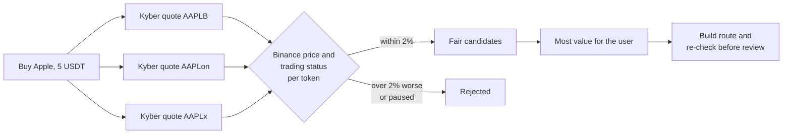
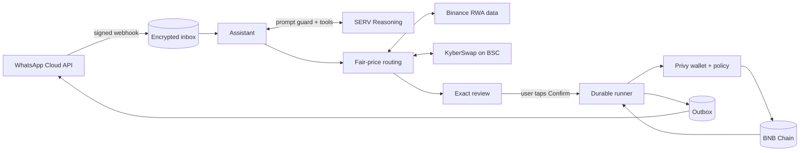

<div align="center">


# Sharebloom

### Buy tokenized US stocks on BNB Chain by texting on WhatsApp.

Apple, Tesla, NVIDIA, Microsoft, the S&P 500 and more, paid in **USDT**.<br/>
Sharebloom compares **bStocks, Ondo and xStocks** on every trade and only fills at a fair price.<br/>
**Nothing moves until you tap Confirm.**

<br/>

[](https://wa.me/2349032729156?text=Hi)


**BNB Hack · Tokenized Stocks**

</div>

---

## 💡 The problem

Every popular US stock on BNB Chain exists as **three different tokens**, one per issuer, each with its own liquidity:

| Stock   | bStocks | Ondo     | xStocks |
| ------- | ------- | -------- | ------- |
| Apple   | `AAPLB` | `AAPLon` | `AAPLx` |
| Tesla   | `TSLAB` | `TSLAon` | `TSLAx` |
| S&P 500 | `SPYB`  | `SPYon`  | `SPYx`  |

A new user can't tell which one to buy, and the wrong pick is expensive. On **29 September 2026**, a live 1 USDT Apple buy quoted:

| Token    | Issuer  | Apple received | Against Binance's price |
| -------- | ------- | -------------- | ----------------------- |
| `AAPLB`  | bStocks | 0.002965       | ✅ **fair, best**       |
| `AAPLon` | Ondo    | 0.002936       | ✅ fair                 |
| `AAPLx`  | xStocks | 0.000483       | ❌ **509% above fair**  |

Buying the "wrong Apple" would have cost six times the fair price. It was the same for the S&P 500 (`SPYx` 863% above fair) and Microsoft (`MSFTx` 623% above fair).

On top of that, most people who want to own Apple don't want to learn about wallets, seed phrases, DEXs, slippage or token addresses.

## ✨ The solution

Sharebloom turns all of that into a WhatsApp chat:

```text
You:        Buy Apple with 5 USDT

Sharebloom: Buy Apple (AAPL)
            BNB Chain
            Issuer: bStocks (AAPLB) · best fair price of 3

            Pay: 5 USDT
            Receive: ≈ 0.01482 AAPLB
            Minimum: 0.01474 AAPLB
            Network fee: up to 0.00004 BNB
            Expires: 14:32 UTC

            [ Confirm buy ]  [ Details ]  [ Cancel ]

You:        Confirm buy

Sharebloom: Trade complete ✅  https://bscscan.com/tx/0x…
```

Behind that one message, Sharebloom:

1. **Understands** the request with SERV Reasoning, behind a prompt-injection guard.
2. **Quotes all three issuers** through KyberSwap on BNB Chain.
3. **Checks each quote** against Binance's reference price for that exact token, and skips tokens Binance marks as not trading.
4. **Rejects** any quote more than **2% worse** than fair, and picks the one that gives you the most.
5. **Shows an exact review** and waits for your tap. The AI has no tool that can confirm or send.
6. **Executes** from your own Privy server wallet, whose policy only allows these 27 tokens, USDT and the KyberSwap router.

## 💬 Things you can say

### 📈 Stocks

```text
Buy Apple with 5 USDT
What would 10 USDT get me in Tesla?
Buy the S&P 500 with 20 USDT
Sell 0.01 NVIDIA
```

### 📊 Prices and holdings

```text
What are the prices?
Show my stocks
What stocks can I buy?
```

### 💸 Wallet

```text
How do I add money?
Send 5 USDT to 0x…
```

**Supported:** AAPL, TSLA, NVDA, MSFT, GOOGL, AMZN, META, SPY and QQQ, each from three issuers (27 tokens).

## ⚖️ How fair-price routing works



- **Reference price.** Binance's public RWA data for each contract address, including its trading status (`openState`). Prices become 18-decimal integers; floating point is never used for money.
- **Deviation.** The quote's effective price against the reference, always measured _against the user_: for a buy, paying more is worse, and for a sell, receiving less is worse. It rounds up, so 2.001% counts as more than 2%.
- **Sells** compare only the issuers you hold enough of.
- **Double check.** The chosen route is rebuilt with calldata and checked again, with a fresh trading status, before you see the review.
- **Registry pinning.** Every configured token is checked against Binance's RWA list (chain 56, address, ticker, symbol and decimals), and `symbol()` and `decimals()` are re-read on-chain. If anything changes, trading stops.

The code is in [`stock-routing.ts`](apps/web/src/server/stocks/stock-routing.ts) and [`binance-rwa.ts`](apps/web/src/server/stocks/binance-rwa.ts). The tests in [`stock-routing.test.ts`](apps/web/tests/stock-routing.test.ts) replay the live Apple observations above.

## 🛡️ Built so the AI can't move your money

| Guard                   | How                                                                                                                                    |
| ----------------------- | -------------------------------------------------------------------------------------------------------------------------------------- |
| The AI can't send       | SERV only gets read and prepare tools. Confirmation is a WhatsApp button handled by code.                                              |
| Prompt-injection guard  | Every SERV request runs `serv_prompt_guard`; a flagged message is refused before any tool runs.                                        |
| Fair price or nothing   | A quote more than 2% worse than Binance's price for that token is rejected.                                                            |
| Wallet policy           | The Privy policy allows only USDT or stock-token `approve`, KyberSwap `swap` and USDT `transfer`, all on chain 56 with zero BNB value. |
| Pinned router           | The KyberSwap router and executor are pinned by bytecode hash; calldata is decoded and matched to the review.                          |
| Exact, expiring reviews | Minimum received and maximum fee are shown. A review expires after 4 minutes and confirms once.                                        |
| Trade cap               | `MAINNET_MAX_USDT_PER_TRADE` limits each trade, up to a hard ceiling of 1,000 USDT.                                                    |
| Unknown outcomes        | A durable runner reconciles every broadcast by its receipt and never retries a trade blindly.                                          |

## 🏗️ Architecture



| Part        | Technology                                                                |
| ----------- | ------------------------------------------------------------------------- |
| App and API | Next.js 16 · TypeScript · viem · zod                                      |
| AI          | SERV Reasoning with tool calling and `serv_prompt_guard`                  |
| Market data | Binance Web3 RWA token list and per-token price                           |
| Trading     | KyberSwap aggregator on BNB Chain                                         |
| Wallets     | Privy server wallets with a generated allow-list policy                   |
| Messaging   | WhatsApp Cloud API: signed webhooks, list menus and reply buttons         |
| Storage     | SQLite (`node:sqlite`) on a persistent volume, sensitive fields encrypted |
| Hosting     | Docker on Railway, with the web app and workers in one service            |

```text
sharebloom/
├── apps/web/
│   ├── src/server/networks/chain.ts   # BNB Chain, USDT and the 27 stock tokens
│   ├── src/server/stocks/             # Binance data, routing, Kyber, policy, runner
│   ├── src/server/whatsapp/           # Assistant, menus, consent, wallet onboarding
│   ├── src/app/                       # Landing page, webhook, privacy pages
│   ├── scripts/                       # Policy creation and setup checks
│   └── tests/                         # Node test suite
├── contracts/                         # Legacy demo contracts (not used on BNB Chain)
└── deploy/                            # Docker Compose + Caddy example
```

## 🛠️ Run it yourself

**Requirements:** Node.js 24+, plus credentials for SERV, Privy and a Meta WhatsApp Business number.

```bash
git clone https://github.com/Yilkash/sharebloom.git
cd sharebloom/apps/web
npm ci
cp .env.example .env.local   # add your own keys; never commit this file
```

```bash
npm run dev                  # website at http://localhost:3000
npm run whatsapp:worker      # WhatsApp and transaction workers
```

Generate the wallet policy from the token list, create it, then verify the setup:

```bash
node --env-file=.env.local --import tsx scripts/mainnet-setup.ts --policy-template
node --env-file=.env.local --import tsx scripts/mainnet-policy-create.ts
node --env-file=.env.local --import tsx scripts/mainnet-verify-setup.ts
```

See [`docs/SETUP.md`](docs/SETUP.md) for every environment variable.

### ✅ Checks

```bash
npm run format:check
npm run typecheck
npm test          # 74 tests
npm run build
```

## ⚠️ Limitations

- Stock tokens track the underlying share price. They are not direct share ownership, and each issuer has its own terms.
- Users need a little BNB for gas alongside their USDT.
- The 2% fairness band is one fixed setting, not tuned per stock.
- Binance's reference price is the source of truth. If it is unavailable, Sharebloom refuses to trade rather than guess.

## 📚 More

- [`docs/ARCHITECTURE.md`](docs/ARCHITECTURE.md): the trade lifecycle and safety design
- [`docs/SETUP.md`](docs/SETUP.md): environment variables and deployment
- [`docs/DX_NOTES.md`](docs/DX_NOTES.md): a build log of integration friction on BNB Chain

<div align="center">

**Sharebloom by Steward Pay** · Stock tokens are BNB Chain tokens, not direct share ownership.

</div>
